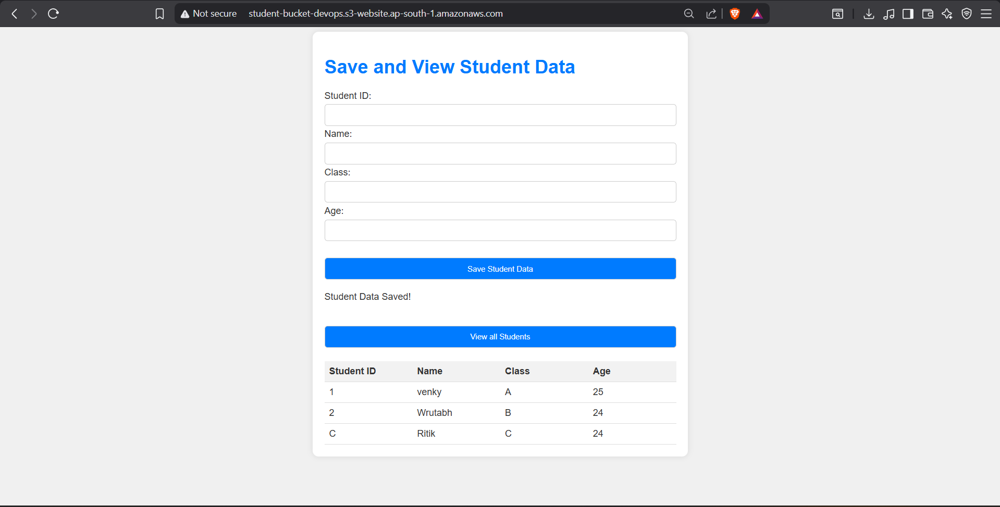
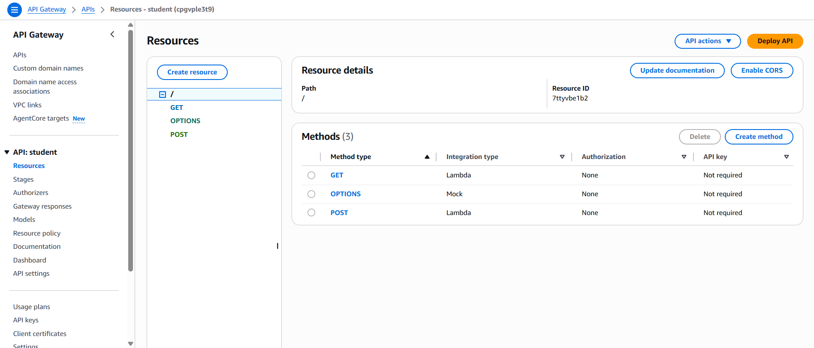
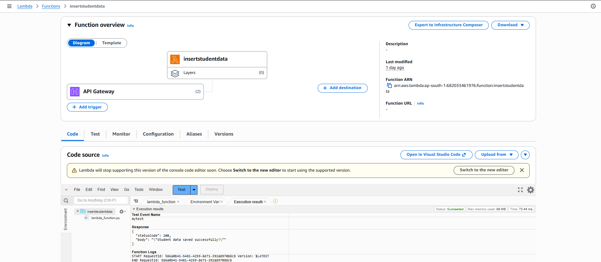
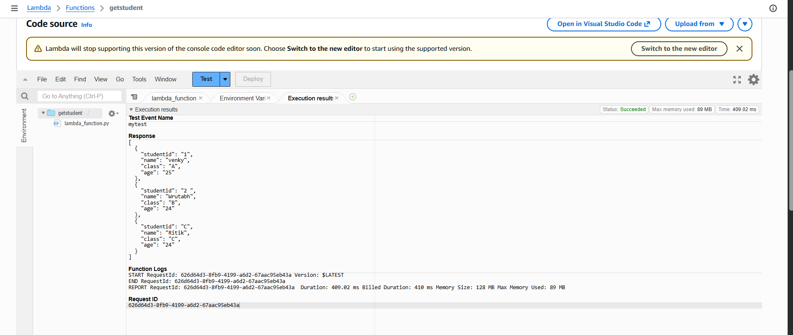
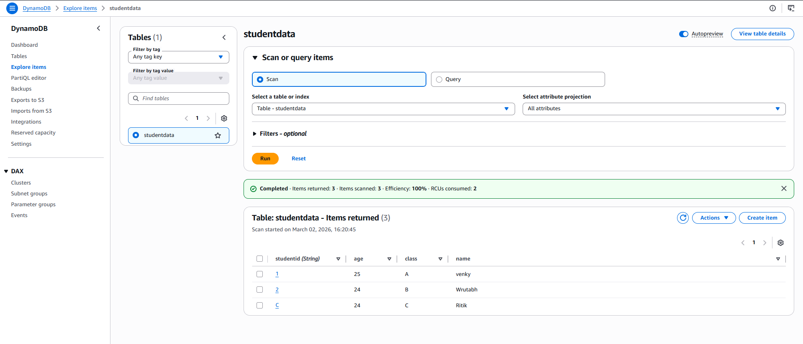
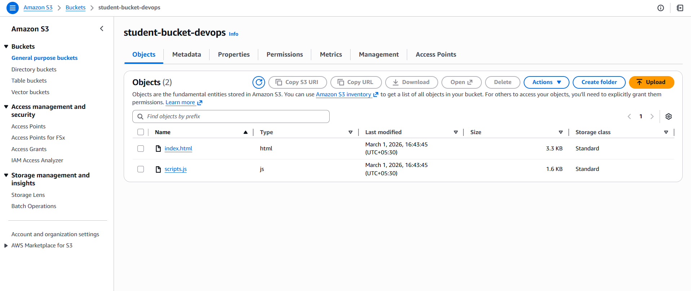

# AWS Serverless Web Application 🚀

## 📌 Project Overview
This is a Serverless Student Management System built using AWS cloud services.  
The application allows users to add and view student records through a fully serverless architecture.

---

## 🛠️ AWS Services Used

- Amazon S3 (Static Website Hosting)
- Amazon API Gateway (REST API)
- AWS Lambda (Python Backend)
- Amazon DynamoDB (NoSQL Database)
- IAM (Access Control)

---

## ⚙️ Features

- Add Student Data
- View All Students
- Fully Serverless Architecture
- Secure IAM Role Configuration
- CORS Enabled API Integration

---

## 🏗️ Architecture Flow

Frontend (S3)  
⬇  
API Gateway  
⬇  
AWS Lambda  
⬇  
DynamoDB  

---

## 📷 Project Screenshots

### 🌐 Website Interface

### 🔌 API Gateway Configuration

### ⚡ Lambda Function - Insert

### ⚡ Lambda Function - Get

### 🗄️ DynamoDB Table

### ☁️ S3 Static Hosting

---

## 🚀 How to Deploy

1. Create S3 bucket and enable static website hosting.
2. Create DynamoDB table.
3. Create Lambda functions (Insert & Get).
4. Connect Lambda with API Gateway.
5. Enable CORS.
6. Deploy API and connect frontend.

---

## 📚 Learning Outcome

- Hands-on experience with AWS Serverless Architecture
- API integration using API Gateway
- Backend logic using AWS Lambda
- NoSQL database handling with DynamoDB
- Cloud deployment best practices

---

Vyanktesh
AWS Serverless Web Application Project
